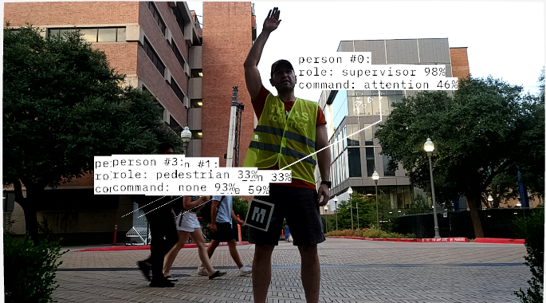

# C2HI
C2HI: Command & Control Hierarchical Interface. Specialized perception to detect the scene, human locations, human roles, and command recognition for human-robot teams.

For context, please see the abstract of our recent [ERAS 25 conference](https://easychair.org/cfp/ERAS25) submission:

`
Human-robot teams (HRTs) for the defense, search \& rescue, security, etc. domains will require humans to act in a hierarchy of roles, such as supervisors, teammates, or pedestrians. \textit{Hierarchical commanding} considers a human's role as well as semantic content of their communication and is critical to perform complex teaming behaviors in dynamic social environments. Today, most HRT robot perception systems receive commands from a single human teammate via one modality, and do not allow nuanced, situationally-appropriate teaming behaviors like hierarchical commanding. Here, we designed, implemented and evaluated a Command \& Control Hierarchical Interface (C$^2$HI). C$^2$HI is a specialized robot perception system that performs multiple perception functions simultaneously, including scene recognition, human tracking, role recognition, and command recognition. We model hierarchical commanding as a multivariate estimation problem and use Dynamic Bayesian Networks (DBNs) to fuse asynchronous, multimodal sensor observations and estimate relevant spatial and semantic variables. To tune and evaluate the interface, we recorded an audiovisual robot dataset in varied operational conditions. We demonstrate the C$^2$HI's ability to concurrently estimate scene, human positions, human roles, and commands from multiple sensor modalities. We present a new method of visual role recognition using the CLIP foundation model with $>90\%$ classification accuracy after $5$ observations, making it comparable to using a fiducial marker. In these open environments, our verbal and gestural command recognition methods achieve overall accuracy of 31\% and 24\%, respectively, on over 800 attempted commands in our evaluation dataset compared to 69\% accuracy achieved using predefined fiducials. We conclude that high-fidelity sensors with simple processing pipelines are the most suitable for hierarchical interaction in dynamic environments. The evaluation dataset, Command and Control project code, and instructions for replicating our results are open source to encourage further development of hierarchical command and control of HRTs.
`

# Usage

## Installation
To install C2HI, follow the installation instructions [here](docs/INSTALL.md).

## Reproducing experimental results
To recreate the results of the paper, follow the experiment instructions [here](docs/EXPERIMENTS.md).

# Collaboration and Issues
If you have questions, concerns, or problems regarding this software or wish to collaborate, please do not hesitate to [raise an issue](https://github.com/UTNuclearRoboticsPublic/c2hi/issues) or [contact me via email](mailto:john.a.duncan@utexas.edu).
